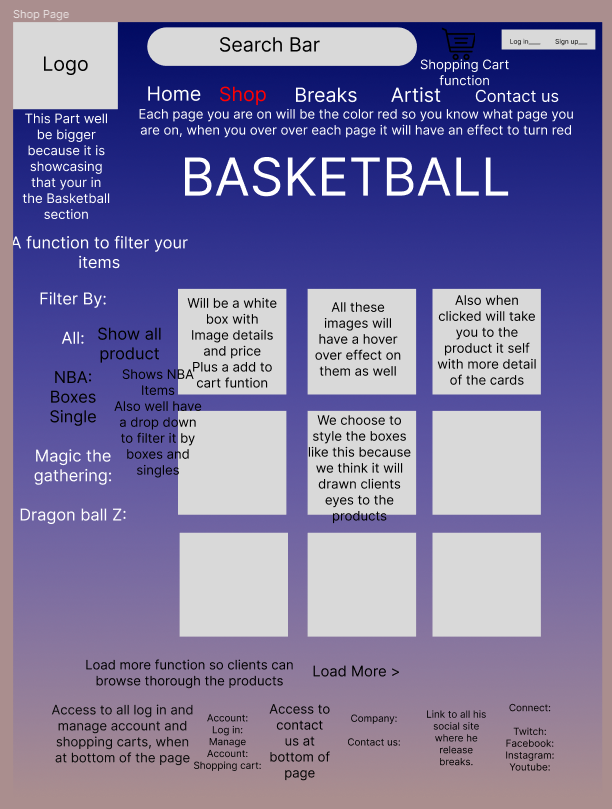

# R1: Description of your website, including:
- Purpose
- Functionality / features
- Target audience
- Tech stack

### Answer:
Jacob and I have choosen a E-commerce website for someone that does twitch breaks of basketball cards.

- Purpose of the website, is for the client to be able to put all his different cards and boxes online to sell and to also promote his streaming sites. Customers will be able have a look at cards and boxes to purchase  

- Functionality of this site will be processing orders, accept payments with stripe payment, as well as provide customer service. Features will be different languages, user-friendly navigation system, search button if you want to search a certain team or player. Will have a footer navigation with his streaming sites, a client of his painting website if people want excellent painting work of basketball players. Will also have a wishlist.

- This website targets anyone that has a interest or know people that love basketball cards.

- Tech stack:
    - Bootstrap CSS
    - Javascript
    - HTML
    - MongoDB
    - Express.js
    - React.js
    - Node.js

# Dataflow Diagram

# Application Architecture Diagram

# User Stories

# Wireframes for multiple standard screen sizes, created using industry standard software

### Desktop view:
Will have a scroll to get to top and bottom of pages.

### Home page:

### Shop pages:

This was one of our orignal ideas for the shop pages but the red is to bright and overpowering. A filter by: NBA, Boxes, Singles, Magic the gathering and Dragon ball Z.

We decided to Change all the Shop page to a graident colour because it is more appealing to the eye.

### Breaks page:

### Artists Page:

### Contact Us page:

### Tablet View:

### Mobile Veiw:

# Screenshots of your Trello board throughout the duration of the project