# R1: Description of your website, including:
- Purpose
- Functionality / features
- Target audience
- Tech stack

### Purpose:

Jacob and I have chosen to build an E-commerce website for a family friend that performs live stream 'box breaks' of basketball cards. For those not up to date on this phenomena, a group of people (30 in this case) chip in money for a spot in the break ($24 AUD in our case). The break is then live streamed and hopefully you may win some expensive shiny new cards that would be more worth more than paying for the spot in the break itself. The client has been involved with all things collectable for over 20 years and has been involved with their streaming breaks for the past 3 years. This has provided the client with a sufficient income stream ever since.

The purpose of the website: is for the client to be able to expand their brand. They wish to attract new customers to the new e-commerce store, promote the box breaks via the website to attract more participants to the breaks, thereby allowing for more variety and sales through those streaming sites for views, which in return will boost revenue from sites like Facebook, Twitch and Instagram and You-tube. The website will provide additional revenue from providing the client 

- Functionality / Features of this site will be:
    - Product listings: The website will display the available products for purchase, including details such as price, product description and images of the product for sale. Customers would be able to browse through products and add items to their cart.

    - Shopping cart: The website would allow customers to add/remove items from their shopping cart and view total cost of their order. 

    - Payment processing: The website would allow integrate with Stripe payment processing to securely process customer payments.

    - Customer accounts: The website would allow customers to create an account and store their personal information, such as shipping and billing addresses. Maybe manage order history(?) or track status of current order(?).

    - Search functionality: The website would include a search bar that customers could use to search items. This may have a filter function that supports advanced search features such as search by card, search all, search by team, search by genre...basketball, dragon ball z and magic the gathering! So many choices!

    - Multilingual support(?): The website may just focus on sales and shipping throughout Australia and New Zealand at present so we don't have to focus on international shipping, local laws and customs etc. Otherwise a component that handles different languages could be awesome! (maybe German).

    - User-friendly navigation: Easy to read navbar and an awesome search button should make it easy for customers to use and find what they are looking for.

    - Wishlist: The website could include a feature that allows customers to save items that they may wish to keep for a future purchase.

    - create the back-end API for the website to CRUD items for sale, user authentication/authorisation, store user information, generate emails through 3rd party apps, create routes and servers etc.

    - Customer Service: perhaps a contact form or chatbot(if I am clever enough?) to assist customers with any questions, queries, theories or thoughts they may have.

- Target Audience: The target audience for this E-commerce website that live streams box breaks of basketball cards and that sells cards and collectables and other memorabilia would be those people who have an interest in basketball cards and other collectables:

    - Sport enthusiasts: People who are passionate about sports and enjoy collecting sports memorabilia, including basketball cards.

    - Card collectors: People who collect basketball cards, as well as people who like collecting Magic the Gathering, dragon ball z and perhaps Pokemon cards.

    - Investors: People who see basketball cards and other collectables as investments and are interested in purchasing rare or valuable cards through an E-commerce website store or through live stream box breaks.

    - Gift shoppers: People looking for that one-off card for a friend or family member that are interested in basketball cards or collectables.

    - Social media followers: People who follow the clients social media accounts and channels for the live banter and interactions (host reactions when they reveal an expensive card, for example).

- Tech stack: Here is a quick run-down on the technology we will be attempting to use to build the client's E-commerce website:
    - Bootstrap CSS: CSS Bootstrap is a popular front-end framework that provides pre-built CSS and JavaScript components for creating responsive and mobile first websites. it helps create a consistent look and feel across the website and saves some time by providing pre-built components.

    - JavaScript:  Is a programming language used to create interactive and dynamic websites. It is most commonly used for client-side scripting, such as validating forms, creating animations and manipulating HTML and CSS.

    - HTML: Is a mark-up language used to create structure and content on web pages. It defines the elements and attributes of a web page and how they are displayed in a browser. 

    - MongoDB: Mongo DB is a NoSQL document database that stores data in JSON-like documents. It is scalable, flexible and provides high-performance for handling large amounts of data.

    - Express.js: Is a popular Node.js web application framework that provides a set of features for building web applications including routing, middleware and error handling.

    - React.js: Is a popular JavaScript library used for building user interfaces. It provides a component-based architecture that makes it easy to reuse code and manage complex User Interfaces (UIs).

    - Node.js: Is a JavaScript runtime environment that allows developers (us) to run JavaScript on the server-side. It provides a set of built-in modules for handling Input/Output operations, networking and file system access.

    - Netlify: Is well-suited for hostin static websites and front-end applications, which it offers features like continuous deployment, CDN integrations and easy configuration.

    - Heroku: Specialises in hosting and scaling server-side applications. It supports multiple programming languages and frameworks, making it a great tool for hosting the backend of MERN stack applications. It offers features such as: automating scaling, easy deployment and seamless integration with popular development tools.

# Dataflow Diagram

# Application Architecture Diagram

# User Stories

### Format:
 Story #:

    As a [persona], I want to [_] so that [_].

### Customer:

    1. As a customer, I want to add or remove items from my cart before checkout so that I can manage my purchases

    2. As a customer, I want to securely process my payment using Stripe integration because it provides a trusted and reliable payment method.

    3. As a customer I want to create an account with a password so that when I make a purchase, or as a returning customer, I can have my shipping and billing information stored so that I don't have to enter them every time I make a purchase.

    4. As a customer, I want to be able to use a search bar to quickly search for items by genre, saving me time an effort.

    5. As a customer, I want the website to have a clear and intuitive/responsive navigation menus, making it easy for me to find different categories of cards or memorabilia and to explore the website effortlessly.

    6. As a customer with questions or issues, I want access to customer service or support through a contact form  or chatbot, so that I can get assistance with any questions, quieries, theories or thoughts I may have.

    7. As a customer, I want the ability to create a wishlist where I can save the products I am interested in but not ready to purchase yet, allowing me to keep track of my desired items for future refernce.

### Client:

    1. As the client, I want an interactive website that is easy to navigate and easy to use, so that I can generate more foot traffic to the website and generate more sales.

    2. As the client who hosts and streams live box breaks, I want the website to display the links to my channels, so that I can increase the foot traffic to these sites, which will help with 'views' and generate extra income and sales.

    3. As the client, I want to have a easy and secure way for customers to make payments, so that I know their details are safe and secure.

    4. As the client, I want customers to be able to get into contact with me, if there is and questions or concerns that I can help them with, so that by ensuring great customer service which will then turn into increase sales and repeat customer service. 

### Collector

    1. As a collector, I want to browse the available products with images and descriptions so that I can make an informed decision on which items to purchase.

    2. As a collector, I want to be able to search and browse for collectible items, such as rare cards, and vintage toys and memorabilia.

    3. As a collector, I want to have access to reliale and efficient shipping services that ensures safe delivery of fragile and valuable collectibles.

    4. As a collector, I want to be able to connect with other collectors through forums or communities provided by the e-commerce site, where i can discuss and trade collectibles.

# Wireframes for multiple standard screen sizes, created using industry standard software

### Desktop view:
Will have a scroll to get to top and bottom of pages.

### Home page:

### Shop pages:

This was one of our original ideas for the shop pages but the red is to bright and overpowering. A filter by: NBA, Boxes, Singles, Magic the gathering and Dragon ball Z.

We decided to Change all the Shop page to a gradient colour because it is more appealing to the eye.

### Breaks page:

### Artists Page:

### Contact Us page:

### Log In page:

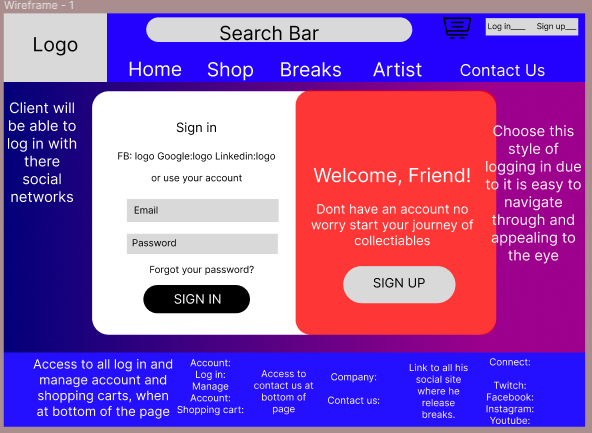

### Sign up Page:

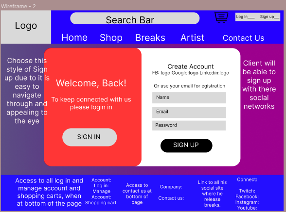

### Tablet View:

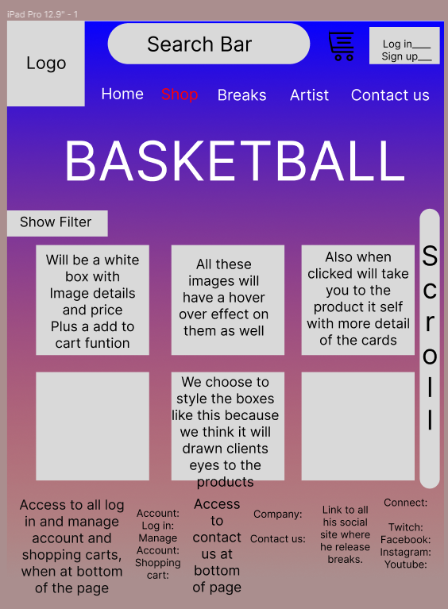

# Screenshots of your Trello board throughout the duration of the project

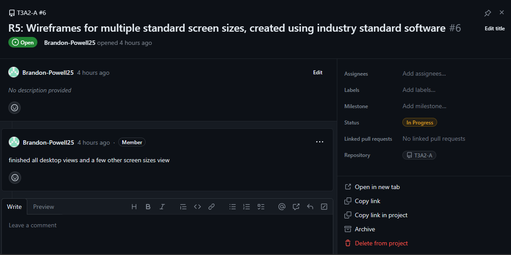

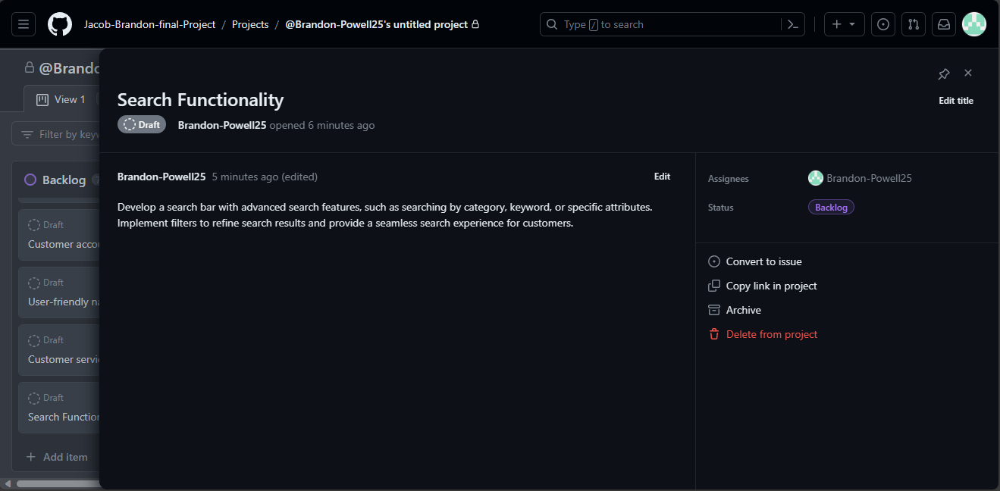

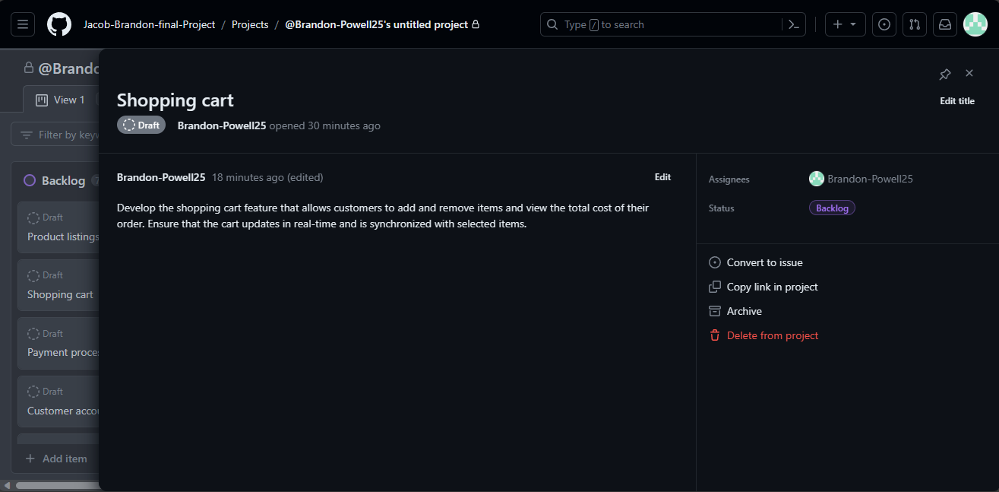

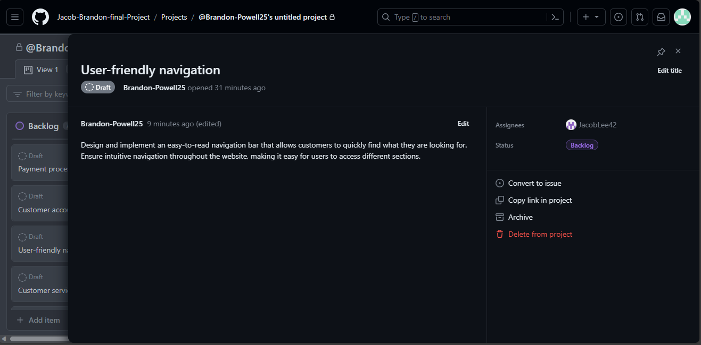

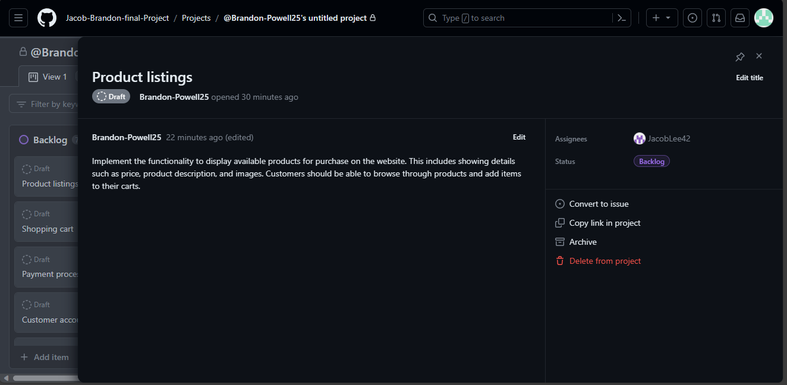

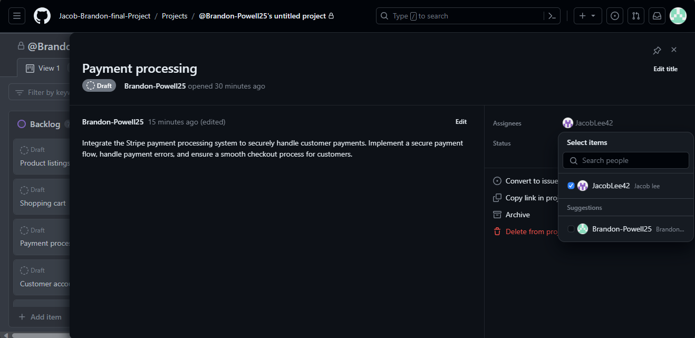

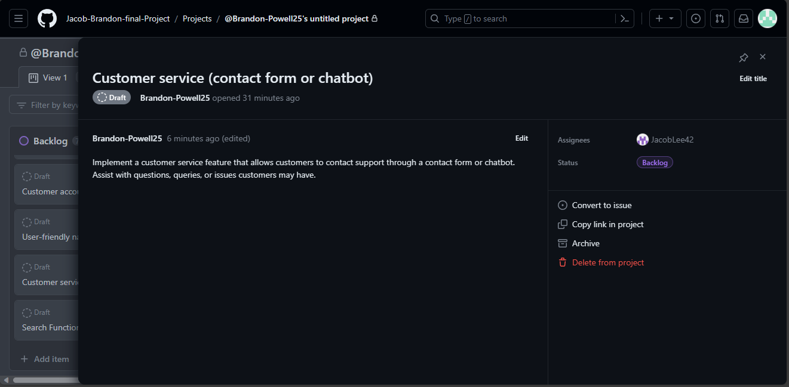

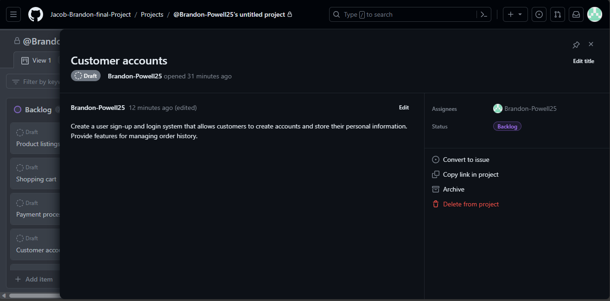
